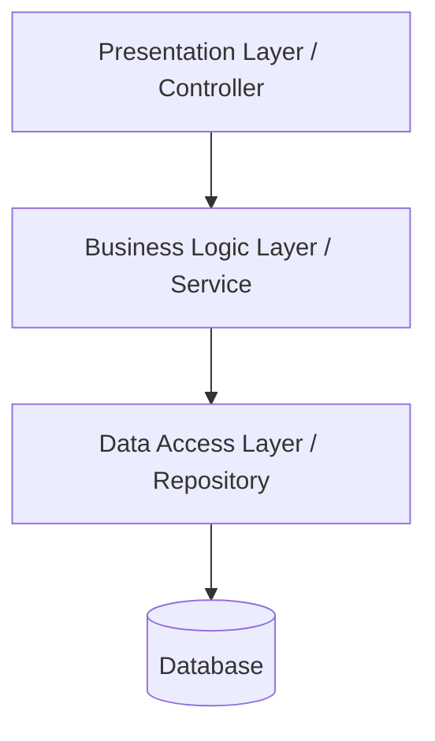
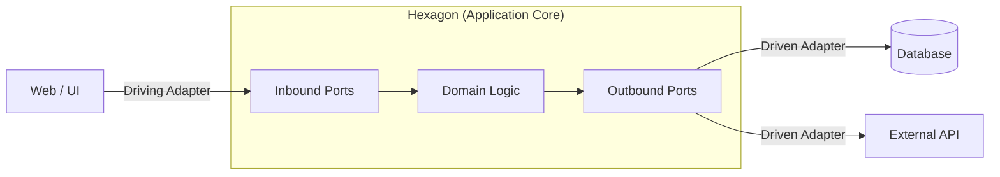
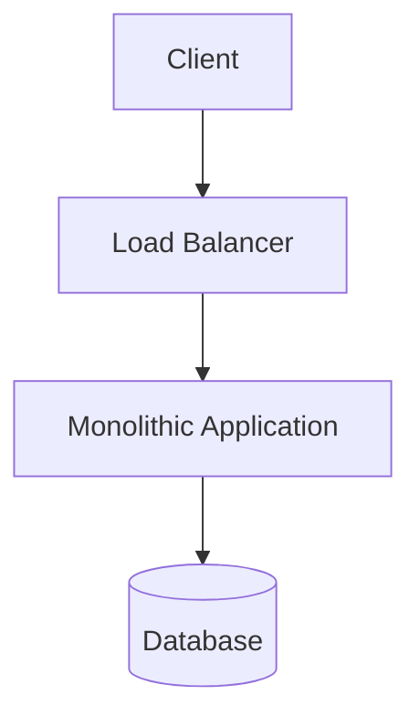
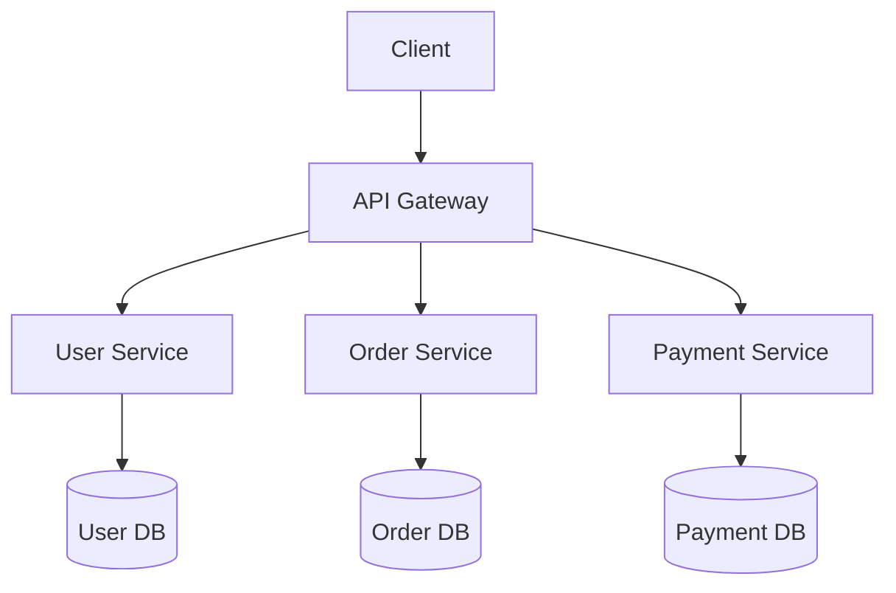

# 🗺️ Backend Architecture Learning Roadmap

이 문서에서는 백엔드 개발에서 주로 사용되는 소프트웨어 아키텍처 패턴들을 학습 순서(로드맵)에 따라 단계별로 다룹니다. 가장 기초적인 단일 애플리케이션의 내부 구조부터, 대규모 트래픽을 처리하기 위한 분산 시스템 설계, 그리고 비동기 처리까지 점진적으로 학습할 수 있도록 구성되었습니다.

> 🔒 **권한 안내 (Private Repositories)**
> 본 문서의 `실제 예시` 섹션에 링크된 각 아키텍처별 프로젝트 구현 코드와 템플릿은 **CodeLab-1325 오거나이제이션 멤버 전용 프라이빗 레포지토리**입니다. 
> 멤버가 아니신 경우 404 오류가 발생할 수 있습니다. 프라이빗 레포지토리 열람 및 프로젝트 협업에 관심이 있으시다면 [CodeLab-1325 프로필(LinkedIn)을 통해 문의](#)해 주세요.

---

## Level 1: 기본 구조의 이해 (Layered Architecture)
가장 기본이 되는 애플리케이션 내부 설계 방식으로, 웹 애플리케이션 개발의 뼈대 역할을 합니다.

### 1. 계층형 아키텍처 (Layered Architecture)
#### 개요
소프트웨어의 구성 요소를 역할과 관심사에 따라 수평적인 계층(Layer)으로 나누어 배치하는 가장 보편적인 아키텍처 패턴입니다. 가장 흔하게 프레젠테이션, 비즈니스, 데이터 액세스 계층으로 분리됩니다.

#### 다이어그램


#### 특징
*   **관심사 분리**: 각 계층이 명확한 책임을 가지고 있어 역할이 분명하며, 코드의 가독성이 좋습니다.
*   **표준화**: 수많은 프레임워크(Spring, Django 등)에서 기본적으로 채택하는 패턴으로 학습 곡선이 낮습니다.
*   **단점 (싱크홀 안티패턴)**: 도메인 로직이 데이터베이스(DB)에 강하게 결합되는 경향이 있으며, 단순 요청도 불필요하게 모든 계층을 거쳐야 할 수 있습니다.

#### 실제 예시
*   [🔗 Layered-Template/README.md](https://github.com/CodeLab-1325/Layered-Template/blob/main/README.md) 🔒

---

## Level 2: 도메인 중심 설계 (Domain-Centric Architecture)
데이터베이스 중심의 사고에서 벗어나, 순수한 비즈니스 로직(Domain)을 보호하고 외부 기술의 변화에 유연하게 대처하기 위한 아키텍처입니다.

### 2. 헥사고날 아키텍처 (Hexagonal Architecture / Ports and Adapters)
#### 개요
비즈니스 로직을 가장 안쪽에 배치하고, 외부 요소(UI, DB, 외부 API)들과의 통신을 '포트(인터페이스)'와 '어댑터(구현체)'를 통해 수행함으로써 의존성을 역전시키는 구조입니다. 클린 아키텍처와 궤를 같이 합니다.

#### 다이어그램


#### 특징
*   **비즈니스 로직 격리**: 핵심 로직이 특정 프레임워크나 데이터베이스 기술에 종속되지 않습니다.
*   **테스트 용이성**: 외부 의존성을 Mock 객체(어댑터)로 쉽게 교체할 수 있어 도메인 단위 테스트 작성이 매우 편리합니다.
*   **단점 (복잡도 증가)**: 수많은 인터페이스와 어댑터를 만들어야 하므로 초기 개발 속도가 느려지고 파일 개수가 많아집니다.

#### 실제 예시
*   [🔗 Hexagonal-Template/README.md](https://github.com/CodeLab-1325/Hexagonal-Template/blob/main/README.md) 🔒

---

## Level 3: 시스템 확장과 분산 (Macro Architecture)
트래픽이 증가하고 팀 규모가 커질 때, 하나의 큰 덩어리(모놀리스)를 어떻게 물리적으로 분리할 것인가에 대한 고민입니다.

### 3. 모놀리식 아키텍처 (Monolithic Architecture)
#### 개요
애플리케이션의 모든 구성 요소(UI, 비즈니스 로직, 데이터베이스 접근 등)가 하나의 통합된 코드베이스로 빌드되고 단일 서버에 배포되는 전통적 아키텍처입니다. 분산 환경으로 넘어가기 전의 가장 기본 형태입니다.

#### 다이어그램


#### 특징
*   **단순성**: 개발, 디버깅, 엔드투엔드(E2E) 테스트 및 배포 파이프라인 구성이 단순합니다.
*   **성능**: 모든 기능이 한 프로세스 내에 있으므로 네트워크 통신 오버헤드 없이 내부 모듈 간 호출이 매우 빠릅니다.
*   **단점 (확장성 한계)**: 특정 기능만의 확장이 불가능하며, 코드가 방대해지면 작은 수정에도 전체를 다시 빌드/배포해야 합니다.

#### 실제 예시
*   [🔗 Monolithic-Template/README.md](https://github.com/CodeLab-1325/Monolithic-Template/blob/main/README.md) 🔒

### 4. 마이크로서비스 아키텍처 (Microservices Architecture, MSA)
#### 개요
거대한 애플리케이션을 비즈니스 도메인 단위로 쪼개어, 독립적으로 배포 및 확장이 가능한 작은 서비스들의 조합으로 구성하는 패턴입니다.

#### 다이어그램


#### 특징
*   **독립성과 확장성**: 트래픽이 몰리는 특정 서비스(예: 결제)만 별도로 스케일 아웃(Scale-out)할 수 있습니다.
*   **기술의 유연성**: 각 서비스별로 최적의 기술 스택(언어, DB)을 선택하고 개별 팀이 독립적으로 일할 수 있습니다.
*   **단점 (운영 복잡도 극대화)**: 분산 환경에서의 장애 추적, 트랜잭션 보장(Saga 패턴 등), 서비스 간 통신 장애 처리 등 인프라 운영 난이도가 급증합니다.

#### 실제 예시
*   [🔗 Microservices-Template/README.md](https://github.com/CodeLab-1325/Microservices-Template/blob/main/README.md) 🔒

---

## Level 4: 비동기와 고성능 처리 (Asynchronous & High Performance)
MSA 등 분산 환경에서 병목을 해소하고, 서비스 간 결합도를 최소화하기 위한 진화된 패턴들입니다.

### 5. 이벤트 기반 아키텍처 (Event-Driven Architecture, EDA)
#### 개요
서비스 간에 직접적인 호출(동기 API 호출)을 피하고, 상태 변화(이벤트)를 메시지 브로커(Kafka, RabbitMQ 등)를 통해 비동기적으로 주고받는 아키텍처입니다.

#### 다이어그램
```mermaid
graph TD
    P1[Order Service (Publisher)] --> Broker((Message Broker))
    P2[User Service (Publisher)] --> Broker
    
    Broker --> S1[Payment Service (Subscriber)]
    Broker --> S2[Notification Service (Subscriber)]
```

#### 특징
*   **느슨한 결합**: 퍼블리셔(발행자)는 구독자가 누군지 몰라도 이벤트를 던질 수 있어 서비스 간 결합도가 크게 낮아집니다.
*   **시스템 탄력성**: 특정 서비스가 죽거나 트래픽이 폭주해도 브로커가 메시지를 보관(버퍼링)하여 장애 전파를 막아줍니다.
*   **단점 (디버깅 난이도)**: 흐름이 비동기적으로 이루어지므로 "주문부터 알림 전송"까지의 전체 로직을 한눈에 파악하거나 에러를 추적(Tracing)하기가 매우 까다롭습니다.

#### 실제 예시
*   [🔗 EventDriven-Template/README.md](https://github.com/CodeLab-1325/EventDriven-Template/blob/main/README.md) 🔒

### 6. CQRS (Command Query Responsibility Segregation)
#### 개요
데이터의 상태를 변경하는 **명령(Command/Write)**과 데이터를 조회하는 **조회(Query/Read)**의 책임을 분리하는 아키텍처 패턴입니다.

#### 다이어그램
```mermaid
graph LR
    Client -->|Command (Write)| CS[Command Service]
    Client -->|Query (Read)| QS[Query Service]
    
    CS --> WDB[(Write DB)]
    WDB -.->|Event/Data Sync| RDB[(Read DB)]
    QS --> RDB
```

#### 특징
*   **조회 성능 극대화**: 조회가 압도적으로 많은 서비스 특성에 맞춰, 조회용 DB(예: Elasticsearch, Redis 등)와 쓰기용 DB를 분리해 병목을 해소합니다.
*   **관심사 분리**: 복잡한 조인 및 검색 로직을 쿼리 쪽으로 몰아넣어, 핵심 비즈니스 로직(명령) 코드를 순수하고 단순하게 유지할 수 있습니다.
*   **단점 (데이터 동기화 이슈)**: 쓰기 DB에 저장된 데이터가 읽기 DB로 동기화되기까지 약간의 시간차(Eventual Consistency)가 발생할 수 있습니다.

#### 실제 예시
*   [🔗 CQRS-Template/README.md](https://github.com/CodeLab-1325/CQRS-Template/blob/main/README.md) 🔒

---

## Level 5: 클라우드 네이티브 패턴 (Cloud Native Patterns)

### 7. 서버리스 아키텍처 (Serverless Architecture)
#### 개요
서버 자원의 프로비저닝이나 관리를 클라우드 제공자(AWS, GCP)에게 완전히 위임하고, 개발자는 오직 실행될 기능(Function) 구현에만 집중하는 아키텍처입니다.

#### 다이어그램
```mermaid
graph TD
    Client --> API[API Gateway]
    API --> F1[AWS Lambda (User)]
    API --> F2[AWS Lambda (Order)]
    F1 --> DB[(DynamoDB)]
    F2 --> DB
```

#### 특징
*   **운영 관리 제로**: 서버를 직접 관리할 필요가 없으며, 트래픽에 따라 인프라가 자동으로 무한 확장이 이루어집니다.
*   **비용 절감**: 서버가 켜져 있는 시간이 아니라, 실제 코드가 실행된 시간과 횟수만큼만 비용을 지불합니다.
*   **단점**: 함수가 처음 호출될 때 로딩 시간이 걸리는 '콜드 스타트(Cold Start)' 현상이 발생할 수 있으며, 클라우드 벤더(AWS 등)에 강력하게 종속됩니다.

#### 실제 예시
*   [🔗 Serverless-Template/README.md](https://github.com/CodeLab-1325/Serverless-Template/blob/main/README.md) 🔒
