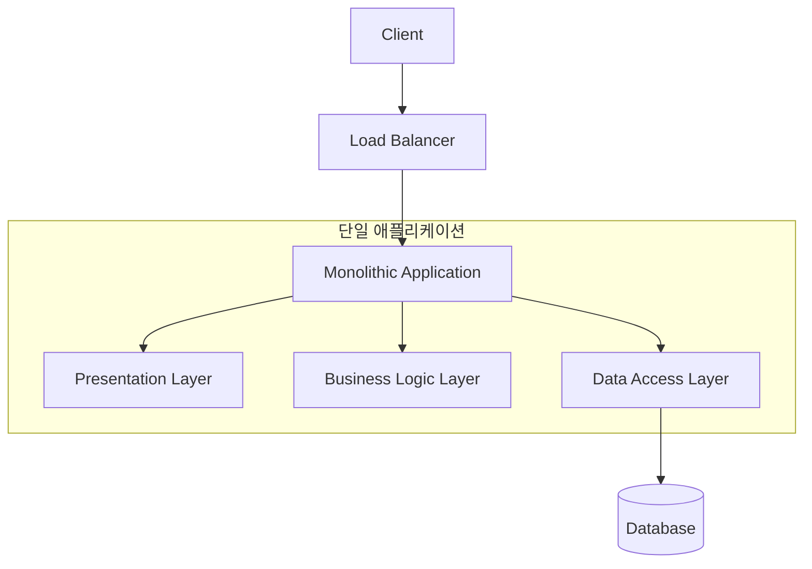
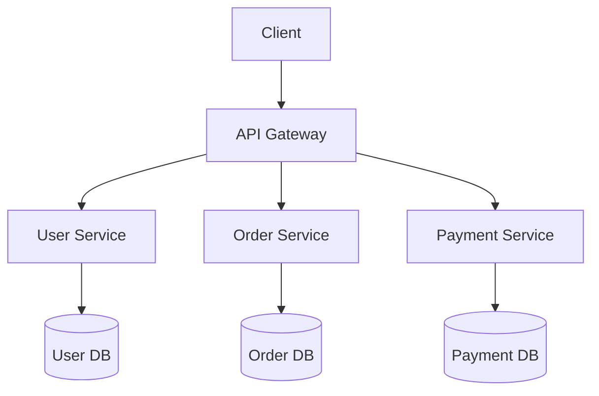
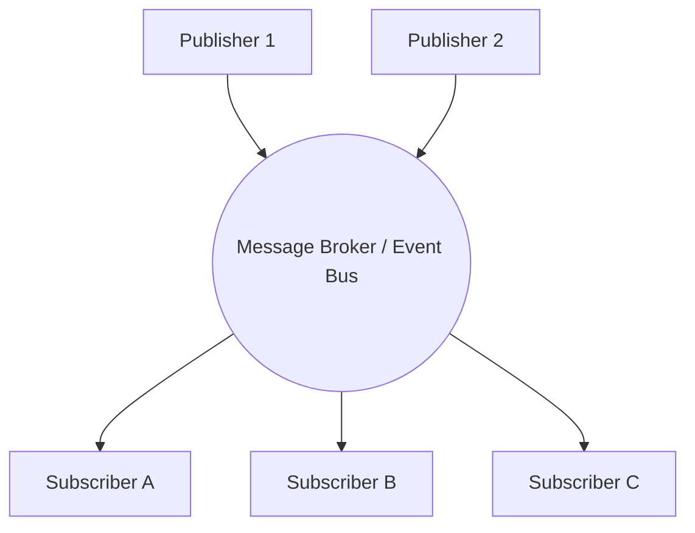
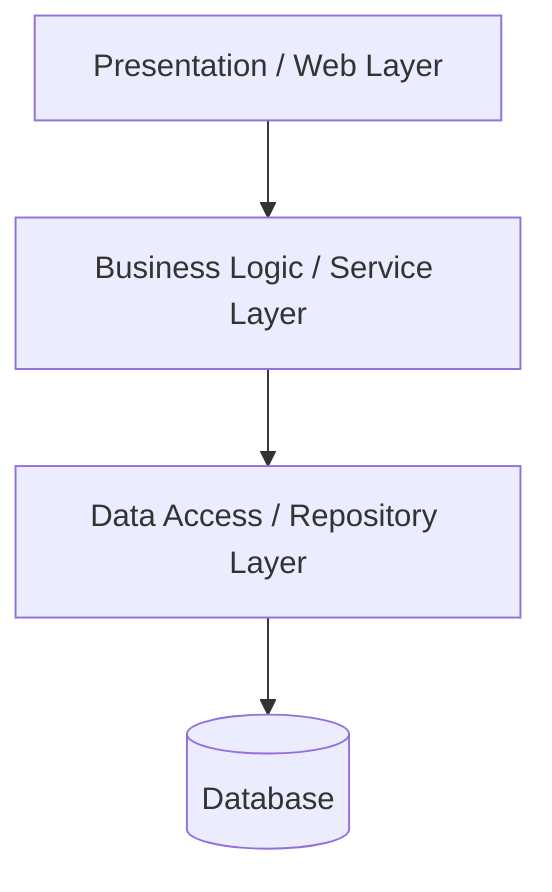

# Backend Architectures

이 문서에서는 백엔드 개발에서 주로 사용되는 주요 소프트웨어 아키텍처 패턴들을 다룹니다.

> 🔒 **권한 안내 (Private Repositories)**
> 본 문서의 `실제 예시` 섹션에 링크된 각 아키텍처별 프로젝트 구현 코드와 템플릿은 **CodeLab-1325 오거나이제이션 멤버 전용 프라이빗 레포지토리**입니다. 
> 멤버가 아니신 경우 404 오류가 발생할 수 있습니다. 프라이빗 레포지토리 열람 및 프로젝트 협업에 관심이 있으시다면 [CodeLab-1325 프로필(LinkedIn)을 통해 문의](#)해 주세요.

---

## 1. 모놀리식 아키텍처 (Monolithic Architecture)

### 개요
모놀리식 아키텍처는 애플리케이션의 모든 구성 요소(사용자 인터페이스, 비즈니스 로직, 데이터 액세스 등)가 하나의 통합된 코드베이스로 이루어지고, 단일 단위로 배포되는 가장 전통적인 아키텍처 형태입니다.

### 다이어그램

### 특징
*   **단순성**: 개발, 테스트, 배포 파이프라인 구축이 비교적 간단합니다. 초기 개발 속도가 빠릅니다.
*   **성능**: 컴포넌트 간 통신이 내부 메모리 함수 호출로 이루어지므로 네트워크 통신 오버헤드가 없습니다.
*   **확장성의 한계**: 병목 현상이 발생하는 특정 기능만 독립적으로 확장하기 어렵고, 전체 시스템을 복제(Scale-out)해야 합니다.
*   **유지보수의 어려움**: 프로젝트 규모가 커질수록 코드 간의 결합도가 높아져 코드의 이해와 수정이 어려워집니다.

### 실제 예시
*   [🔗 Monolithic-Template/README.md](https://github.com/CodeLab-1325/Monolithic-Template/blob/main/README.md) 🔒

---

## 2. 마이크로서비스 아키텍처 (Microservices Architecture, MSA)

### 개요
마이크로서비스 아키텍처는 규모가 큰 애플리케이션을 독립적으로 배포 가능한 작고 느슨하게 결합된 서비스들의 모음으로 구성하는 아키텍처 패턴입니다. 각 서비스는 독립적인 데이터베이스를 가지며 가벼운 통신 방식(주로 HTTP/REST API 또는 메시지 큐)을 사용해 상호작용합니다.

### 다이어그램

### 특징
*   **독립적인 배포 및 확장**: 각 서비스를 독립적으로 배포할 수 있으며, 트래픽이 많은 특정 서비스만 개별적으로 확장할 수 있습니다.
*   **기술 스택의 유연성**: 서비스마다 도메인 특성에 맞는 가장 적합한 프로그래밍 언어나 데이터베이스를 선택할 수 있습니다.
*   **장애 격리**: 하나의 서비스에 장애가 발생하더라도 시스템 전체로 장애가 전파되는 것을 방지할 수 있습니다.
*   **높은 복잡도**: 서비스 간 네트워크 통신 지연, 분산 트랜잭션 처리, 통합 모니터링 및 배포 환경 구성 등 인프라와 운영 측면의 복잡도가 크게 증가합니다.

### 실제 예시
*   [🔗 Microservices-Template/README.md](https://github.com/CodeLab-1325/Microservices-Template/blob/main/README.md) 🔒

---

## 3. 이벤트 기반 아키텍처 (Event-Driven Architecture)

### 개요
이벤트 기반 아키텍처는 시스템 내에서 발생하는 상태의 변화(이벤트)를 생성(Publish)하고 감지하여 처리(Subscribe)하는 것을 중심으로 동작하는 비동기 분산 아키텍처 패턴입니다.

### 다이어그램

### 특징
*   **느슨한 결합**: 이벤트를 생산하는 쪽과 소비하는 쪽이 서로의 존재를 알 필요가 없어 서비스 간 결합도를 최소화합니다.
*   **비동기 처리와 높은 응답성**: 요청을 큐나 이벤트 버스에 넣고 즉시 응답을 반환할 수 있어 시스템의 응답성이 향상됩니다.
*   **뛰어난 확장성**: 트래픽 폭주 시 브로커가 버퍼 역할을 수행하여 안정성을 높이고, 소비자를 늘려 쉽게 확장할 수 있습니다.
*   **추적 및 디버깅의 어려움**: 이벤트 흐름이 여러 서비스를 거치므로, 비즈니스 로직의 전체 흐름을 파악하거나 오류를 추적(Tracing)하기 어렵습니다.

### 실제 예시
*   [🔗 EventDriven-Template/README.md](https://github.com/CodeLab-1325/EventDriven-Template/blob/main/README.md) 🔒

---

## 4. 계층형 아키텍처 (Layered Architecture)

### 개요
소프트웨어의 구성 요소를 역할과 관심사에 따라 수평적인 계층(Layer)으로 나누어 배치하는 가장 보편적인 아키텍처 패턴입니다. 각 계층은 바로 하위 계층에만 의존하며, 프레젠테이션, 비즈니스, 데이터 액세스 계층 등으로 분리됩니다.

### 다이어그램

### 특징
*   **관심사 분리**: 각 계층이 명확한 책임을 가지고 있어 역할이 분명하며, 코드의 가독성이 좋습니다.
*   **테스트 용이성**: 각 계층별로 독립적인 단위 테스트를 작성하기 수월합니다 (특히 Mocking 활용).
*   **표준화**: 수많은 개발자들에게 익숙한 패턴이므로, 새로운 개발자의 팀 합류 및 코드 파악이 빠릅니다.
*   **계층 우회 제한**: 단순한 CRUD 기능도 무조건 모든 계층을 통과해야 하므로(싱크홀 안티패턴) 비효율이 발생할 수 있습니다.

### 실제 예시
*   [🔗 Layered-Template/README.md](https://github.com/CodeLab-1325/Layered-Template/blob/main/README.md) 🔒
